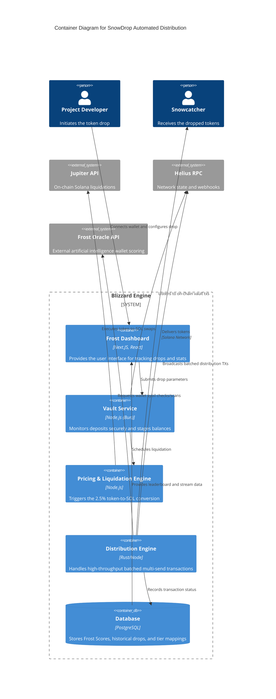

# Architecture Decision Record and C4 Model

## Status

Accepted

## Context

SnowDrop requires a decentralized, automated pipeline to handle thousands of token transfers across Solana without requiring the initiator to hold or spend SOL for gas. We require high throughput, sybil resistance, and a specialized liquidation engine to cover operational costs autonomously.

## Decision

We utilize a Node.js/Bun distributed microservice model integrating Helius for RPCs, Jupiter for liquidity staging, and our Frost Oracle for AI-scored wallet targeting.

## Container Diagram

## Containers Details

### Frost Dashboard

- **Type**: Web Application
- **Technology**: Next.js, Vercel
- **Description**: Displays the total SOL volume distributed, projects frosted, and personal Frost Scores.

### Vault Service

- **Type**: Background Job Queue
- **Technology**: Bun / Node.js
- **Description**: Secure memory space for indexing inbound SPL tokens before distribution. Limits access based on authorization keys.

### Pricing & Liquidation Engine (The Melt)

- **Type**: Processing Service
- **Technology**: Node.js
- **Description**: The core differentiator. Takes 2.5% of any inbound token and queries Jupiter API for the optimal route to swap to SOL.

### Distribution Engine

- **Type**: Transaction Broadcaster
- **Technology**: Rust / Node.js
- **Description**: Processes thousands of wallet addresses, chunks them into viable Solana transaction limits, and signs them using the vault's derived SOL balance.
